# Hello there 👋

C and Go developer based in France. I build projects I like on my free time.

## 🔭 What I'm working on

### [Norite](https://github.com/Alexnex31/Norite)
Self-hosted voice & text chat where the terminal is a first-class client, voice calls included.
Go backend, a local daemon per user, CLI + TUI in one binary, a native GPU-rendered GUI (Gio), web client later.

Done so far: accounts & sessions, 2FA, OAuth, guilds/channels/roles with a full permission model,
audit log, messaging with edit history, moderation reports. Next up: the first client.

### [My_GD](https://github.com/Alexnex31/My_GD)
A Geometry Dash remake in C with CSFML: level loading, hitboxes, ship mode.
Currently being reworked: new physics & camera, music selection, options, and later a level editor and many more features.
I'm working on this project on the side so expect slow progress here.

## 🛠️ Stack

## 📫 Contact

[Email](mailto:alexandre.duffez@gmail.com)
